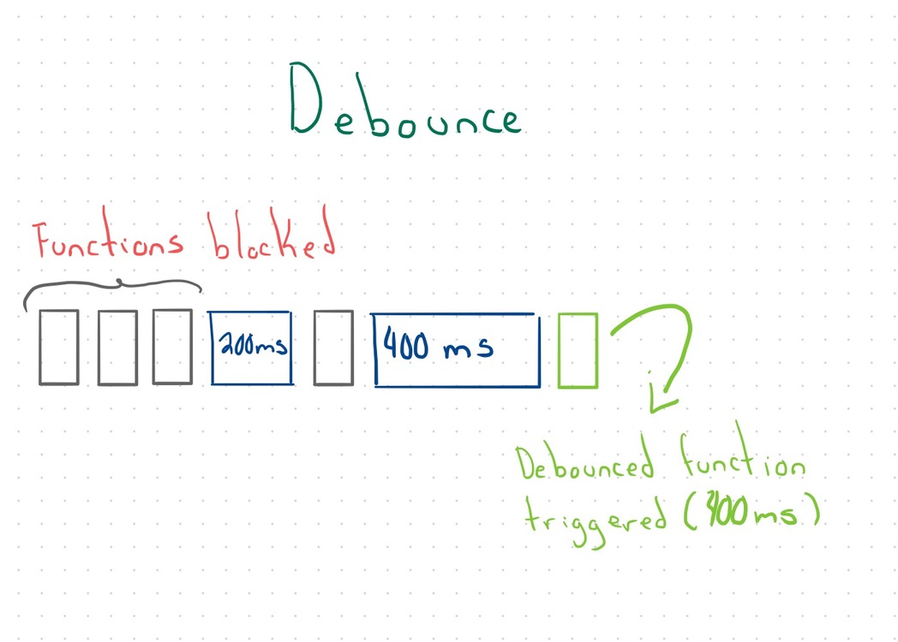
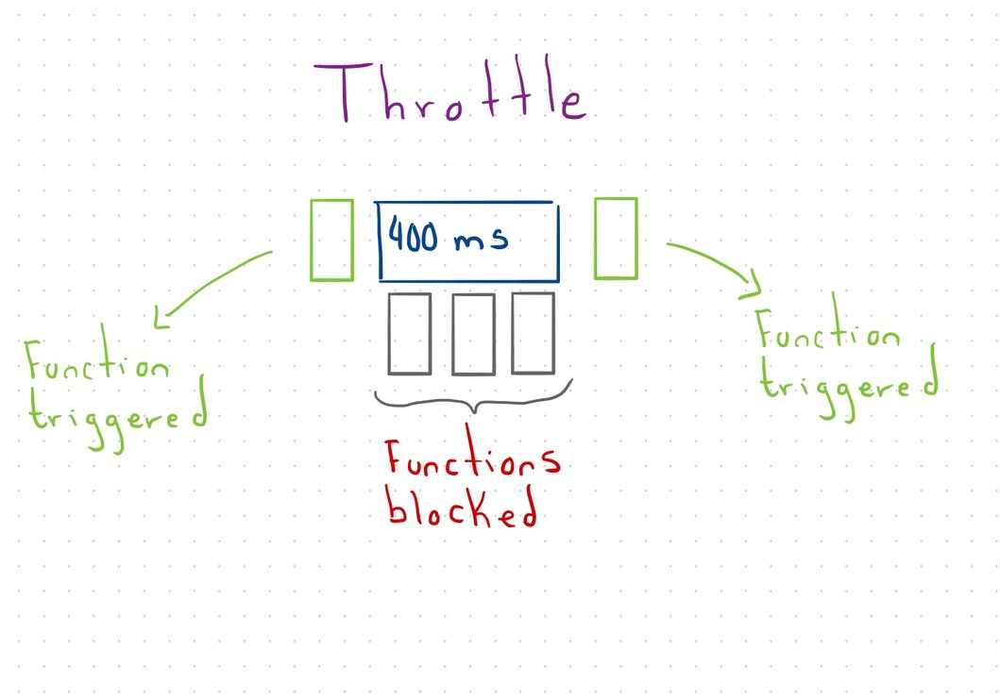

_**Know your functions** is a series of posts that help us to understand how our daily utils work under the hood_

Functions are a fundamental part of most of the programming languages.

When dealing with performance, functions could be part of our bottlenecks. Fortunately, there are tools like throttle and debounce.

Both functions exist in lodash, one of the most famous libraries in the javascript ecosystem.

However, before jumping into installing it, wait a little bit!

Let's understand what they are, and **how do they work**.

# Going back to the drawing board

First of all, what the heck are those functions?

## Debounce

Debounce is a tool that receives a function and a delay.
It triggers the function after this delay happened.

If something calls the function again before the requested time finishes,
it resets the timer and starts the waiting all over again.



## Throttle

Throttle is pretty similar to debounce.

Instead of resetting the timer, it blocks any function call that happens while the delay is running.



# Building our utils

## Debounce

The principles of a debounce function are

- Set a function to be called and a timer to trigger the function
- Reset the timer every time this function is called
- Trigger the last function call when the timer ends.

By following these concepts, our debounce function looks like this:

```typescript
type Func = (...args: any[]) => any

const debounce = <T extends Func>(fn: T, delay: number) => {
  let timeout: NodeJS.Timer
  return (...args: Parameters<T>) => {
    clearTimeout(timeout)
    timeout = setTimeout(() => fn(...args), delay)
  }
}
```

## Throttle

The principles of a throttle function are

- Set a function to be called and a timer to block other function calls
- Block the function if it is called while the timer is running
- Trigger a function only when the timer is not running

Our throttle function looks like this:

```typescript
type Func = (...args: any[]) => any

const throttle = <T extends Func>(fn: T, delay: number) => {
  let timeout: NodeJS.Timer
  return (...args: Parameters<T>) => {
    if (timeout !== undefined) {
      return
    }

    timeout = setTimeout(() => {
      timeout = undefined
    }, delay)

    return fn(...args)
  }
}
```
